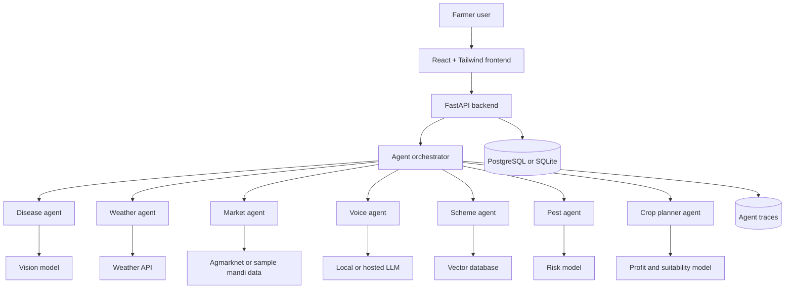

# Agri-AI

Software-only autonomous agent system for smallholder agricultural decision-making.

## Goal

Build a demo-ready multi-agent agriculture assistant before June 10. The system avoids hardware-heavy irrigation and focuses on agents that can run from software inputs: crop images, weather APIs, market data, voice/text questions, government scheme documents, and seasonal pest-risk rules.

## MVP Scope

The project should prove that a farmer can open one app and receive joined-up guidance from specialized agents.

### Phase 1 Agents

- Disease agent: accepts crop image uploads and returns probable disease, confidence, treatment guidance, and prevention steps.
- Weather agent: uses city or GPS-style location input to show rainfall, heat, humidity, and farm-risk alerts.
- Market agent: shows mandi-style crop prices, short-term trend direction, and selling advice.
- Voice agent: lets farmers ask questions in simple language and returns readable advisory responses.

### Phase 2 Agents

- Scheme agent: answers questions from government scheme PDFs using retrieval augmented generation.
- Pest agent: predicts pest risk using crop, season, weather, and region.
- Crop planner agent: suggests crops from season, location, market price, and risk score.

## Architecture



## Suggested Folder Structure

```text
agri-ai/
├── frontend/          React app
├── backend/           FastAPI server
├── agents/
│   ├── disease/
│   ├── weather/
│   ├── market/
│   ├── voice/
│   ├── scheme/
│   └── pest/
├── models/            Saved ML models
├── datasets/          Sample CSVs, PDFs, and image references
└── docker/            Deployment files
```

## How The Request Flows

1. Farmer opens the React app.
2. Farmer uploads a crop image, chooses location, selects crop, or asks a text/voice question.
3. FastAPI receives the request and sends it to the orchestrator.
4. The orchestrator routes the request to one or more agents.
5. Each agent returns structured output with `summary`, `confidence`, `evidence`, and `recommended_action`.
6. The orchestrator merges the answer into one advisory response.
7. The frontend shows cards, alerts, charts, and next steps in farmer-friendly language.

## June 10 Build Plan

- Week 1: frontend dashboard, architecture, mocked agent responses.
- Week 2: FastAPI backend, API contracts, disease upload endpoint, weather endpoint.
- Week 3: market CSV/API pipeline, voice/text assistant, scheme document retrieval.
- Final days: polish UI, add demo data, write report, record walkthrough.

